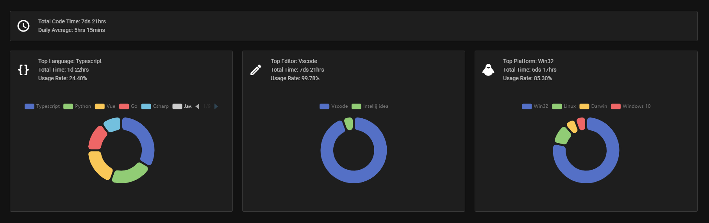

# CodeTime

CodeTime vscode plugin. Statistical analysis of programming time.

Web Site: [Code Time](https://codetime.datreks.com)

## Previews

## Usage

1. Login from web site: [Code Time](https://codetime.datreks.com).
2. Get token from web site: [Code Time / account](https://codetime.datreks.com/account).
3. In VSCode, Press <kbd>F1</kbd>, enter `token` to find the command: `Code Time: Enter Token`, Press <kbd>Enter</kbd> and then input your token.
4. Write some code, visit the dashboard and check if data is available.
