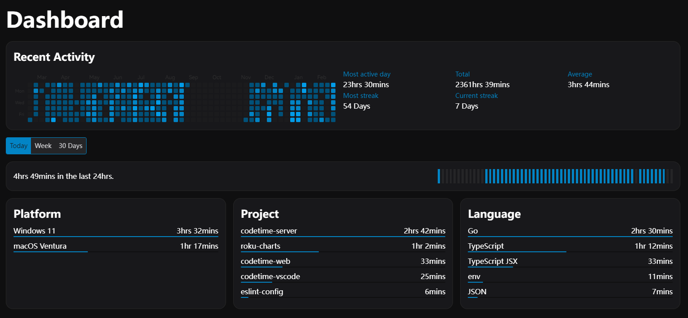
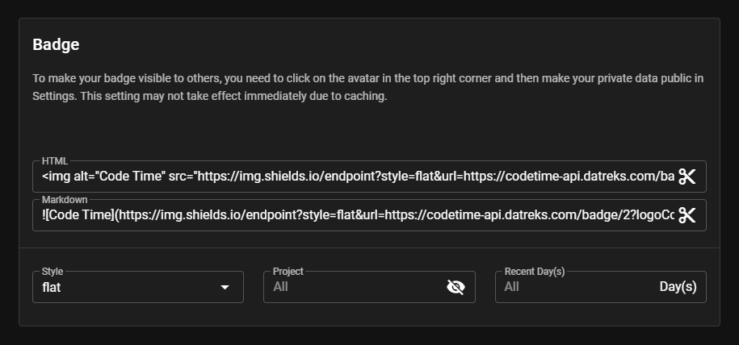

# CodeTime

CodeTime vscode plugin. Statistical analysis of programming time.

Web Site: [Code Time](https://codetime.dev)

## Previews

## Usage

1. Login from web site: [CodeTime](https://codetime.dev).
2. Get token from web site: [CodeTime / settings](https://codetime.dev/settings).
3. In VSCode, Press <kbd>F1</kbd>, enter `token` to find the command: `CodeTime: Enter Token`, Press <kbd>Enter</kbd> and then input your token.
4. Write some code, visit the dashboard and check if data is available.

> If using an online IDE like [GitHub Codespaces](https://docs.github.com/en/codespaces), add your token to global ENV variable `CODETIME_TOKEN`.

## Settings

### Status Bar Info

You are able to select what time to show in your status bar by:

- Press <kbd>Ctrl</kbd> (or <kbd>command</kbd> in Mac OS) + <kbd>,</kbd>, then search `codetime` to find the options.
- Press <kbd>F1</kbd>, enter `codetime` to find the options.

Supported options are:

- total: Show total code time
- average: Show average code time.
- today: Show today code time.
